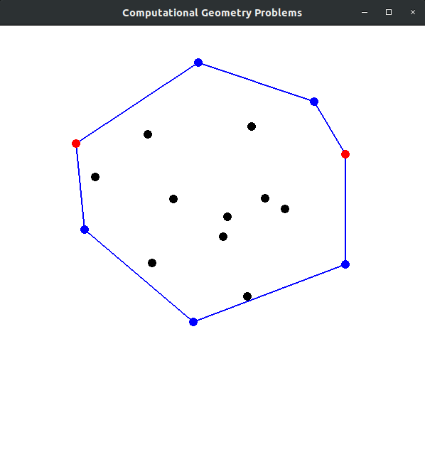
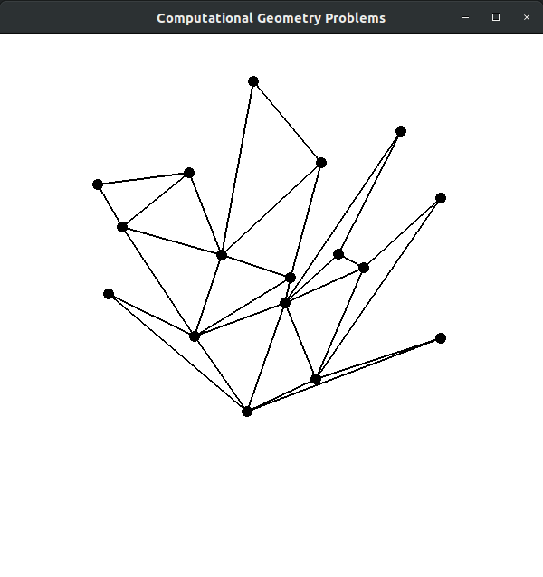
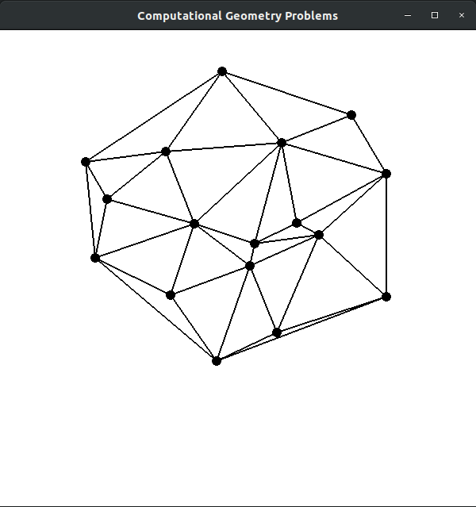
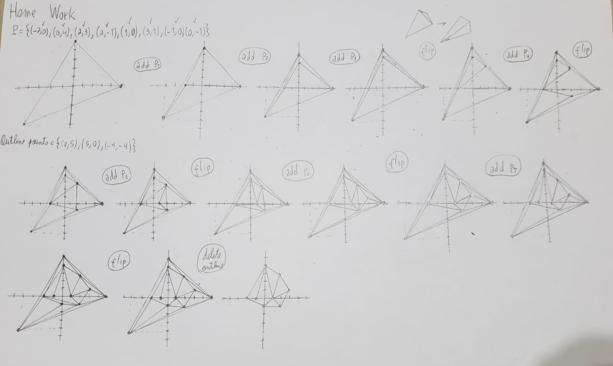

# ComputationalGeometryOpenGL
In this project I am testing some concepts of computational geometry using OpenGL for visualization. This repository came from the discipline "SCC0910 - Advanced Topics in Computer Science", taught the professor Phan Thanh An.

Current algorithms implemented:
- Convex hull
 - Graham
 - Quick Hull
- Triangulation
 - Ear Clipping
 - Edge Flip

## ConvexHull
This is a common problem in computational geometry. Given a set of points, it is necessary to calculate the outermost points so that they circumvent all other points.

#### Graham Algorithm

</img>

This is a common algorithm to solve the convex hull problem. Some questions proposed by Phan Thanh An:

1. What happens if you replace “lowest”by ”highest”?

  There is no difference Convex Hull formed. The chosen point will belong to Convex Hull and the search direction of the other points will continue counterclockwise.

  

  </img>
  

2. What happens if you replace “strictly left” by left”?

  In this case it may happen that the chosen starting point has the smallest possible Y coordinate between the points, but does not have the smallest / largest X possible among all points with this smallest Y coordinate. In this situation, the formed Convex Hull is correct, but will not be Convex Hull with as few points as possible.

3. What happens if you replace “rightmost lowest point” by “a point in the interior of the convex hull”?

  The "Convex Hull" formed by the algorithm will not be correct because it will have a point (the initial) that will not belong to the true Convex Hull.

  

  </img>
  

The necessary code modifications to test each case are in `src/classes/convexHull/graham.cpp` (_getFirstPoint_ method)

#### Quick hull
  

  </img>
  

  In the algorithm, we build the convex hull incrementally. We started this algorithm by considering the two outer points. After that, we select the furthest point to add to the convex hull. All points within the polygon are ignored and new farther points are added.

## Triangulation
  In this problem, given a set of points, we need to make triangles joining three points so that they do not intersect. There are many possibilities given the points, inside these triangulations there is a _Delaunay Triangulation_, which has interesting features. The _Edge Flip_ algorithm can be used to find the Delaunay triangulation.
#### Ear Clipping
  

  </img>
  

  The triangulation from this simple algorithm do not have interesting features. It is a "strange" triangulation, but it is easy to calculate.

#### Edge Flip
  

  </img>
  

  This algorithm add the points incrementally and looks for wrong edges to flip. After adding all points and making all the necessary flips, we can get the Delaunay Triangulation.

  In the image below I show how this algorithm works given the set **P**.

  

  </img>
  

